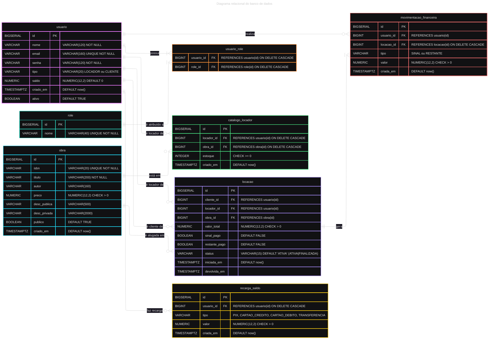

# Sistema de Gerenciamento de Aluguel de Livros – Desafio Técnico

## Sumário
- [Visão Geral](#visão-geral)
- [Stack](#stack)
- [Setup Rápido](#setup-rápido)
- [Credenciais Iniciais](#credenciais-iniciais)
- [Fluxo de Negócio](#fluxo-de-negócio)
- [Distribuição da Lógica (Banco x Aplicação)](#distribuição-da-lógica-banco-x-aplicação)
- [Migrações Flyway](#migrações-flyway)
- [Campos Públicos vs Privados da Obra](#campos-públicos-vs-privados-da-obra)
- [Regras Financeiras Automatizadas](#regras-financeiras-automatizadas)
- [Endpoints Principais](#endpoints-principais)
- [Diagramas / Modelo](#diagramas--modelo)
- [Próximos Passos / Melhorias](#próximos-passos--melhorias)

## Visão Geral
Dois perfis: LOCADOR e CLIENTE. Obras são globais (por ISBN). Locadores adicionam obras ao próprio catálogo com estoque. Cliente inicia locação, paga automaticamente 50% (sinal), obtém acesso à descrição privada e ao finalizar (devolução) paga os 50% restantes; estoque é restituído. Saldo do cliente é debitado/creditado via triggers. Recargas alimentam saldo.

## Stack
- Java 17 / Spring Boot 3.3.x
- JSP (JSTL) / Tomcat embutido
- PostgreSQL 16 + Flyway
- Maven Wrapper

## Setup Rápido
Pré-requisitos: Java 17+, Docker (opcional para banco) ou PostgreSQL local.

1. Exportar variáveis (PowerShell):
```
$env:DB_URL="jdbc:postgresql://localhost:5544/dunnas_rental";
$env:DB_USER="default"; $env:DB_PASSWORD="default"
```
2. Subir banco (exemplo docker):
```
docker run --name dunnas-pg -e POSTGRES_USER=default -e POSTGRES_PASSWORD=default -e POSTGRES_DB=dunnas_rental -p 5544:5432 -d postgres:16
```
3. Migrar e rodar:
```
./mvnw -DskipTests flyway:migrate
./mvnw -DskipTests spring-boot:run
```

## Credenciais Iniciais
Usuários seed criados nas migrações iniciais (ajuste conforme necessário):
- Locador: (ver dados inseridos na V1/V2) – senha já codificada em BCrypt.
- Cliente: idem.

## Fluxo de Negócio
1. Locador cadastra obra (global). Outro locador pode adicioná-la ao seu catálogo.
2. Cliente vê lista pública (dados básicos + descrição pública).
3. Cliente inicia locação => trigger gera movimentação do SINAL (50%) debitando saldo e marcando sinal_pago.
4. Cliente obtém acesso à descrição privada enquanto a locação estiver ATIVA.
5. Finalização: trigger cria RESTANTE (50%) se necessário, debita saldo, devolve estoque, marca locação FINALIZADA e revoga acesso privado.
6. Recarga saldo: insere linha recarga_saldo; trigger credita saldo e gera extrato consistente.

## Distribuição da Lógica (Banco x Aplicação)
Banco (PL/pgSQL / constraints / triggers):
- Validação de 50% (sinal/restante) e criação automática das movimentações.
- Débito automático do saldo ao inserir movimentacao_financeira (sinal/restante).
- Crédito automático em recarga (after insert) e atualização de saldo.
- Controle de estoque: decremento ao iniciar locação; restituição ao finalizar.
- Garantia de consistência de status e flags sinal_pago / restante_pago.

Aplicação (Spring MVC / Controllers / Views):
- Autenticação e autorização (Spring Security).
- Exibição condicional de descrição privada.
- Cache volátil de permissão (invalidate on finalize) para reduzir queries repetitivas.
- Validações de formulário (Bean Validation) complementares.
- Navegação JSP e mensagens para UX.

> Aproximadamente >50% da lógica crítica (financeiro, estoque, integridade das locações) está no banco.

## Migrações Flyway

Aqui está um resumo prático das migrações aplicadas ao banco. Use como referência rápida ao revisar a evolução do esquema e das regras de negócio.

- V1 — Estrutura base
  - Cria `role`, `usuario` e `usuario_role`, além do tipo `user_tipo` (enum). Contém seeds iniciais para desenvolvimento.

- V2 — Ajustes de seeds e roles
  - Atualiza contas seed e reassocia roles (limpeza/normalização de dados de desenvolvimento).

- V3 — Entidades do domínio
  - Cria `obra`, `catalogo_locador`, `locacao` e `movimentacao_financeira` (com enums iniciais para status/tipo) e índices úteis para consultas.

- V4 — Regras e triggers primeiras
  - Introduz funções e triggers para validar estoque, decrementar/recuperar estoque, validar/persistir movimentações e atualizar flags na locação.

- V5 — Conversões e consistência
  - Ajustes para compatibilidade com JPA: conversões controladas de tipos, recriação de triggers quando necessário, e seeds refinadas.

- V6 — Automação de pagamentos (sinal)
  - Gera automaticamente o pagamento de SINAL (50%) ao criar uma locação e aplica validações mais estritas para sinal/restante.

- V7 — Saldo e débito automático
  - Adiciona coluna `saldo` em `usuario`, credita saldos demo e move a lógica de débito para o banco (validação e atualização atômica do saldo).

- V8 — Recargas (meios de pagamento)
  - Cria `recarga_saldo` e uma trigger para creditar saldo após inserção; originalmente usa enum para tipos de recarga.

- V9 — Ajuste de tipos de recarga
  - Converte `recarga_saldo.tipo` de enum para `VARCHAR` e adiciona CHECK com valores permitidos (compatibilidade JPA).

- V10 — Flexibiliza finalização
  - Ajusta validações para permitir finalização quando o SINAL estiver pago; o RESTANTE passa a ser tratado automaticamente por triggers posteriores.

- V11 — Campo de descrição pública/privada
  - Adiciona `desc_publica` e `desc_privada` à tabela `obra`, separando visibilidade pública e conteúdo privado acessível durante locação ativa.

- V12 — Normaliza `usuario.tipo`
  - Converte `usuario.tipo` de enum para `VARCHAR(20)` e aplica `CHECK` (LOCADOR|CLIENTE), encerrando a migração dos enums para texto.

Como executar / reparar
- Executar migrações: `./mvnw -DskipTests flyway:migrate`
- Se alterar um script já aplicado em desenvolvimento: `./mvnw -DskipTests flyway:repair`

## Campos Públicos vs Privados da Obra
Migração V11 introduziu:
- desc_publica (descricaoPublica)
- desc_privada (descricaoPrivada)

Visibilidade:
- Listagem `/catalogo/obras`: mostra somente descricaoPublica e marcador de material privado.
- Página `/obras/{id}/privada`: acessível para LOCADOR ou CLIENTE com locação ATIVA daquela obra.
- Após finalização da locação, o cache é revogado e o cliente perde acesso à descrição privada.

Implementação:
- Controller verifica locação ATIVA (query) e usa `PrivateDescriptionPermissionCache` (ConcurrentHashMap) para reuso durante o período ativo; revoga em finalize.

## Regras Financeiras Automatizadas
- Trigger AFTER INSERT locação: gera SINAL (50%) se não existir, debita saldo e marca sinal_pago.
- Trigger AFTER UPDATE locação (finalização): gera RESTANTE (50%) se pendente, debita saldo, devolve estoque.
- Trigger BEFORE INSERT movimentacao_financeira: valida saldo suficiente e lógica de 50% para sinal/restante.
- Trigger AFTER INSERT recarga_saldo: credita saldo.

## Endpoints Principais
- GET `/catalogo/obras` – listagem global com descrição pública.
- GET `/catalogo/obras/gerenciar` – gestão (LOCADOR).
- POST `/catalogo/obras/gerenciar` – cadastra obra.
- GET `/locacoes/disponiveis` – catálogo locável filtrado por estoque.
- POST `/locacoes` – inicia locação.
- GET `/locacoes/minhas` – locações ativas do cliente.
- POST `/locacoes/finalizar` – finaliza locação.
- GET `/locacoes/extrato` – extrato (movimentações + recargas).
- POST `/locacoes/recarga` – recarga de saldo.
- GET `/obras/{id}/privada` – descrição privada.

## Mudanças de interface (27/08/2025)

Organizei a interface para deixar as telas mais consistentes e centralizar onde novas obras são criadas.

O que foi feito
- Centralizei o cadastro de obras na tela de gerenciamento: `/catalogo/obras/gerenciar` (JSP: `WEB-INF/jsp/obras_gerenciar.jsp`). O formulário POST continua nessa rota.
- Removi o botão e o modal duplicados do catálogo do locador (`/locador/catalogo` — `WEB-INF/jsp/catalogo_locador.jsp`) para evitar dois pontos de criação.
- Padronizei as tabelas para usar o CSS global (`src/main/resources/static/css/style.css`): retirei estilos inline e simplifiquei a marcação das tabelas (thead/tbody) em várias JSPs.

Principais arquivos alterados
- `WEB-INF/jsp/obras_gerenciar.jsp`
- `WEB-INF/jsp/catalogo_locador.jsp`
- `WEB-INF/jsp/locacoes_historico_locador.jsp`
- `WEB-INF/jsp/obras.jsp`
- `WEB-INF/jsp/locacoes_disponiveis.jsp`
- `WEB-INF/jsp/locacoes_minhas.jsp`
- `WEB-INF/jsp/extrato.jsp`

Impacto
- Não mudei rotas de API — a alteração é de UX/markup: a tela de criação fica centralizada.
- Para que o header mostre corretamente as opções por perfil, `ObraController.gerenciar(...)` agora envia `tipo`, `saldo` e `username` ao model.

## Diagrama relacional do banco de dados
